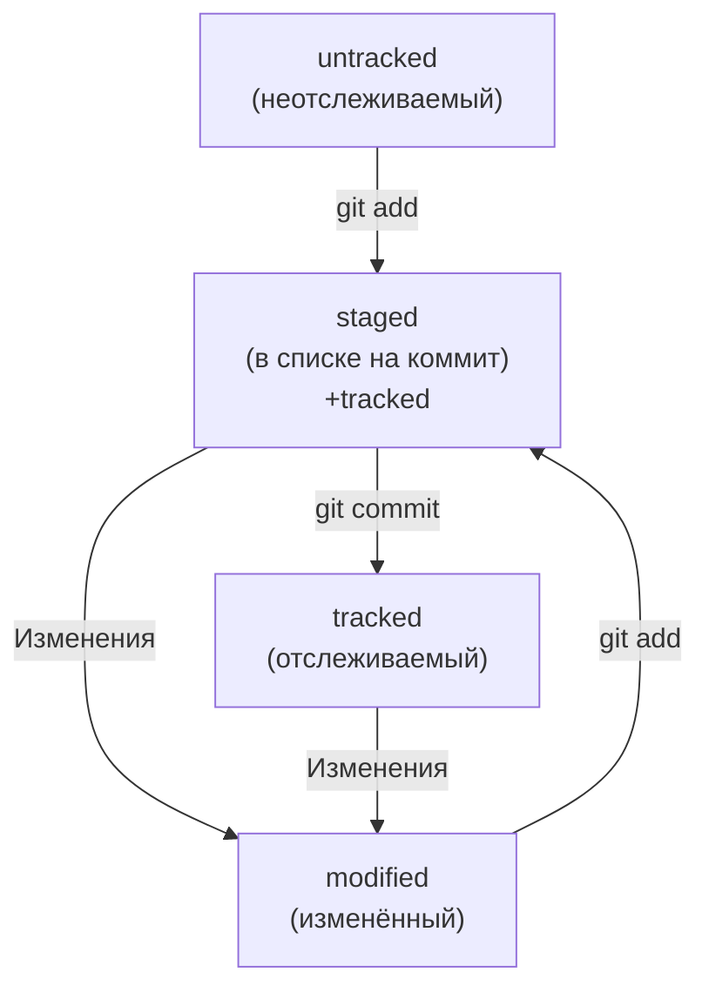

Изначально это было тестовое задание Яндекс.Практикума, но потом все перешло в шапргалку с основными командами Git.

---

## **Навигация**
* **pwd** (от англ. *print working directory*, «показать рабочую папку») — покажи, в какой я папке;
* **ls** (от англ. *list directory contents*, «отобразить содержимое директории») — покажи файлы и папки в текущей папке;
* **ls -a** — покажи также скрытые файлы и папки, названия которых начинаются с символа .;
* **cd first-project** (от англ. *change directory*, «сменить директорию») — перейди в папку first-project;
* **cd first-project/html** — перейди в папку html, которая находится в папке first-project;
* **cd ..** — перейди на уровень выше, в родительскую папку;
* **cd \~** — перейди в домашнюю директорию (/Users/Username);
* **cd /** — перейди в корневую директорию (в Windows можно перейти на диск, но через букву диска **cd /c**).

---

## **Работа с файлами и папками**

#### **Создание**
* **touch index.html** (англ. *touch*, «коснуться») — создай файл index.html в текущей папке;
* **touch index.html style.css script.js** — если нужно создать сразу несколько файлов, можно напечатать их имена в одну строку через пробел;
* **mkdir second-project** (от англ. *make directory*, «создать директорию») — создай папку с именем second-project в текущей папке.

#### **Копирование и перемещение**
* **cp file.txt ~/my-dir** (от англ. *copy*, «копировать») — скопируй файл в другое место;
* **mv file.txt ~/my-dir** (от англ. *move*, «переместить») — перемести файл или папку в другое место.

#### **Чтение**
* **cat file.txt** (от англ. *concatenate and print*, «объединить и распечатать») — распечатай содержимое текстового файла file.txt.

#### **Удаление**
* **rm about.html** (от англ. *remove*, «удалить») — удали файл about.html;
* **rmdir images** (от англ. *remove directory*, «удалить директорию») — удали папку images;
* **rm -r second-project** (от англ. *remove*, «удалить» + *recursive*, «рекурсивный») — удали папку second-project и всё, что она содержит.

#### **Полезные возможности**
* Команды необязательно печатать и выполнять по очереди. Можно указать их списком — разделить двумя амперсандами **(&&)**.
* У консоли есть собственная память — буфер с несколькими последними командами. По ним можно перемещаться с помощью клавиш со стрелками вверх **(↑)** и вниз **(↓)**.
* Чтобы не вводить название файла или папки полностью, можно набрать первые символы имени и дважды нажать **Tab**. Если файл или папка есть в текущей директории, командная строка допишет путь сама.  
Например, вы находитесь в папке dev. Начните вводить cd first и дважды нажмите **Tab**. Если папка first-project есть внутри dev, командная строка автоматически подставит её имя. Останется только нажать Enter.

---

## **Инициализация репозитория**
**git init** (от англ. *initialize*, «инициализировать») — инициализируй репозиторий.

## **Подготовка файла к коммиту**
**git add todo.txt** (от англ. *add*, «добавить») — подготовь файл todo.txt к коммиту;
**git add --all** (от англ. *add*, «добавить» + *all*, «всё») — подготовь к коммиту сразу все файлы, в которых были изменения, и все новые файлы;
**git add .** — подготовь к коммиту текущую папку и все файлы в ней.

## **Создание коммита**
**git commit -m "Комментарий к коммиту."** (от англ. *commit*, «совершать», «фиксировать» + *message*, «сообщение») — сделай коммит и оставь комментарий, чтобы было проще понять, какие изменения внесены. 

## **Просмотр информации о коммитах**
**git log** (от англ. *log*, «журнал [записей]») — выведи подробную историю коммитов.

## **Просмотр состояния файлов**
**git status** (от англ. *status*, «статус», «состояние») — покажи текущее состояние репозитория.

---

## **Хеш, лог и HEAD**

#### **Хеш - идентификатор коммита**
* **Хеширование** (от англ. *hash*, «рубить», «крошить», «мешанина») — это способ преобразовать набор данных и получить их «отпечаток» (англ. *fingerprint*);
* Информация о коммите — это набор данных: когда был сделан коммит, содержимое файлов в репозитории на момент коммита и ссылка на предыдущий, или **родительский** (англ. *parent*), коммит. Git хеширует (преобразует) эту информацию с помощью алгоритма **SHA-1** (от англ. **S**ecure **H**ash **A**lgorithm — «безопасный алгоритм хеширования») и получает для каждого коммита свой уникальный хеш — результат хеширования;
* Результат хеширования в Git — символьная строка. Она относительно коротка (**40** символов в случае SHA-1) и состоит из цифр **0-9** и латинских букв **A-F** (неважно, заглавных или строчных);
* Хеш обладает следующими важными свойствами:
	* если хеш получить дважды для одного и того же набора входных данных, то результат будет гарантированно одинаковый;
	* если хоть что-то в исходных данных поменяется (хотя бы один символ), то хеш тоже изменится (причём сильно).
* Git хранит таблицу соответствий **|хеш → информация о коммите|**. Если вы знаете хеш, вы можете узнать всё остальное: автора и дату коммита и содержимое закоммиченных файлов. Можно сказать, что хеш — основной идентификатор коммита;
* Все хеши и таблицу **|хеш → информация о коммите|** Git сохраняет в служебные файлы. Они находятся в скрытой папке **.git** в репозитории проекта.

#### **Исследуем лог**
* После вызова **git log** появляется список коммитов с их описанием:
  <ol>
  <li>Строка из цифр и латинских букв после слова **commit** - это хеш коммита;</li>
  <li>**Author** - имя автора и его электронная почта;</li>
  <li>**Date** - дата и время создания коммита;</li>
  <li>Сообщение к коммиту.</li>
  </ol>
* **git log --oneline** (англ. «одной строкой») - Сокращённый лог, при этом в терминале появятся только первые несколько символов хеша каждого коммита и комментарии к ним;
* Сокращённый хеш (первые несколько символов полного) можно использовать точно так же, как и полный. Для этого команда **git log --oneline** автоматически подбирает такую длину сокращённых хешей, чтобы они были уникальными в пределах репозитория и Git всегда мог понять, о каком коммите идёт речь;
* Если выход из просмотра логов не произошёл автоматически, нажмите клавишу **Q** (от англ. **Q**uit — «выйти») в английской раскладке клавиатуры.

#### **HEAD - всему голова**
* Файл **HEAD** (англ. «голова», «головной») — один из служебных файлов папки **.git**. Он указывает на коммит, который сделан последним (то есть на самый новый);
* Внутри **HEAD** — ссылка на служебный файл: **| refs/heads/master |** (или **| refs/heads/main |** в зависимости от названия ветки). Если заглянуть в этот файл, можно увидеть хеш последнего коммита;
* Когда выполняется коммит, Git обновляет **| refs/heads/master |** — записывает в него хеш последнего коммита. Получается, что **HEAD** тоже обновляется, так как ссылается на **| refs/heads/master |**;
* Многие команды Git принимают в качестве параметра хеш коммита. Если нужно передать последний коммит, то вместо его хеша можно просто написать слово **HEAD** — Git поймёт, что имеется в виду последний коммит.

---

## **Статусы файлов в Git**
* Одна из ключевых задач Git — отслеживать изменения файлов в репозитории. Для этого каждый файл помечается каким-либо статусом;
* Основные статусы:
	* **untracked** (англ. «неотслеживаемый»). Новые файлы в Git-репозитории помечаются как **untracked**. Git «видит», что такой файл существует, но не следит за изменениями в нём. У **untracked**-файла нет предыдущих версий, зафиксированных в коммитах или через команду **git add**;
 	* **staged** (англ. «подготовленный»). После выполнения команды **git add** файл попадает в **staging area** (от англ. *stage* — «сцена», «этап [процесса]» и *area* — «область»), то есть в список файлов, которые войдут в коммит. В этот момент файл находится в состоянии **staged**;
 	* **tracked** (англ. «отслеживаемый»). Состояние **tracked** — это противоположность **untracked**. Оно довольно широкое по смыслу: в него попадают файлы, которые уже были зафиксированы с помощью **git commit**, а также файлы, которые были добавлены в **staging area** командой **git add**. То есть все файлы, в которых Git так или иначе отслеживает изменения;
	* **modified** (англ. «изменённый»). Состояние **modified** значит, что Git сравнил содержимое файла с последней сохранённой версией и нашёл отличия. Например, файл был закоммичен и после этого изменён.
* Важные нюансы:
	* Для файлов в состояниях **staged** и **modified** обычно не указывается, что они также **tracked**, потому что это состояние подразумевается;
	* Команда **git add** добавляет в **staging area** только текущее содержимое файла. Если, например, сделать **git add file.txt**, а затем измените **file.txt**, то новое содержимое файла не будет находиться в **staging**. Git сообщит об этом с помощью статуса **modified**: файл изменён относительно той версии, которая уже в **staging**. Чтобы добавить в **staging** последнюю версию, нужно выполнить **git add file.txt** ещё раз.

---

## **Типичный жизненный цикл файла в Git**

1. Файл только что создали. Git ещё не отслеживает его содержимое. Состояние: **untracked**;
2. Файл добавили в **staging area** с помощью **git add**. Состояние: **staged** (+ **tracked**);
    a. Возможно, изменили файл ещё раз. Состояния: **staged**, **modified** (+ **tracked**). Обратите внимание: **staged** и modified** у одного файла, но у разных его версий.
    b. Ещё раз выполнили **git add**. Состояние: **staged** (+ **tracked**);
3. Сделали коммит с помощью **git commit**. Состояние: **tracked**;
4. Изменили файл. Состояние: **modified** (+ **tracked**);
5. Снова добавили в **staging area** с помощью **git add**. Состояния: **staged** (+ **tracked**);
6. Сделали коммит. Состояния: **tracked**;
7. Повторили пункты **4-7** много-много раз.

---

## **Какие состояния показывает команда git status**
* Большинство файлов в типичном проекте находятся в состоянии **tracked** (то есть закоммичены и не изменены после коммита). Это состояние не видно в выводе команды **git status** — иначе она бы каждый раз выводила список вообще всех файлов проекта. В итоге **git status** показывает только следующие состояния файлов:
	* **staged** (**_Changes to be committed_** в выводе **git status**);
	* **modified** (**_Changes not staged for commit_**);
	* **untracked** (**_Untracked files_**).
1. Нет ни **staged-**, ни **modified-**, ни **untracked-**файлов. Это означает, что в репозитории нет новых или изменённых файлов;
2. **_Untracked files:_**. Найдены неотслеживаемые файлы, которые отображаются в секции неотслеживаемых файлов — **Untracked files**. Это значит, что они не были добавлены в репозиторий через **git add**;
3. **_Changes not staged for commit:_**. Найдены изменения, которые не войдут в коммит. Файлы были изменены, но не добавлены в **staging area** после этого. Так они оказались в секции **Changes not staged for commit** (англ. «изменения, которые не подготовлены к коммиту»), соответствующей статусу **modified**. Следует подготовить правки к коммиту через **git add**;
4. Файл добавлен в **staging area**, но после этого изменён. Файл попал и в **staged** (**_Changes to be committed_**), и в **modified** (**_Changes not staged for commit_**). В **staging area** находится версия файла до изменения, а в **_Changes not staged for commit_** — уже изменённая версия. Чтобы закоммитить самую свежую версию файла, нужно снова выполнить **git add** перед коммитом.

---